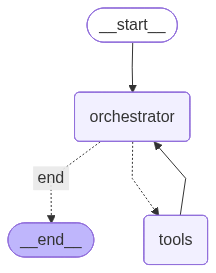

# JobTrack AI — Job applications that don't suck

**Problem:** A properly tailored application (company research + CV match +
personalised cover letter) takes 2 hours per role. Most people either
apply generically (low callback rate) or apply to 5 roles carefully (unsustainable).

**Solution:** A 6-step autonomous agent that researches the company, tailors
your CV bullets, writes a personalised cover letter, and drafts a LinkedIn
cold DM — in under 8 minutes. All outputs saved locally.

**[Live API](https://jobtrack.up.railway.app)** ·
**[LangSmith Traces](https://smith.langchain.com/...)** ·
**[Example Output](docs/example-output/)**

## How it works




| Step | Agent action                     | Tool used            |
|------|----------------------------------|----------------------|
| 1    | Scrape job posting               | Playwright Chromium  |
| 2    | Research the company             | Playwright + Google  |
| 3    | Tailor CV bullets to match role  | Claude Sonnet        |
| 4    | Write personalised cover letter  | Claude Sonnet        |
| 5    | Draft LinkedIn cold DM           | Claude Haiku         |
| 6    | Log everything to tracker        | File MCP server      |

## Eval scores (LLM-as-judge, 3 real job applications)
| Metric            | Score |
|-------------------|-------|
| Overall quality   | 4.2/5 |
| Personalisation   | 100%  |
| Role match        | 100%  |
| Professional tone | 100%  |

*Scored by Claude Sonnet acting as a hiring manager.*
*See [docs/evaluation/eval_results.json](docs/evaluation/eval_results.json) for full results.*


## Claude Desktop integration (MCP)

Add to `~/Library/Application Support/Claude/claude_desktop_config.json`:
```json
{"mcpServers": {"jobtrack": {"command": "python", "args": ["/path/to/mcp/server.py"]}}}
```
Then ask Claude: "List my applications" or "Read my cover letter for Anthropic"

## Quick start
```bash
git clone https://github.com/you/jobtrack-ai
pip install -r requirements.txt && playwright install chromium
cp .env.example .env  # add ANTHROPIC_API_KEY + CV_PATH
python -m agent.graph  # or: uvicorn api.main:app --port 8001
```

## What I'd build next
1. **LinkedIn MCP** — auto-send the cold DM via LinkedIn's browser interface
2. **Follow-up scheduler** — if no reply in 7 days, draft a polite follow-up
3. **Interview prep** — generate likely interview questions based on job + company profile
4. **A/B test cover letters** — track which letter style gets more callbacks